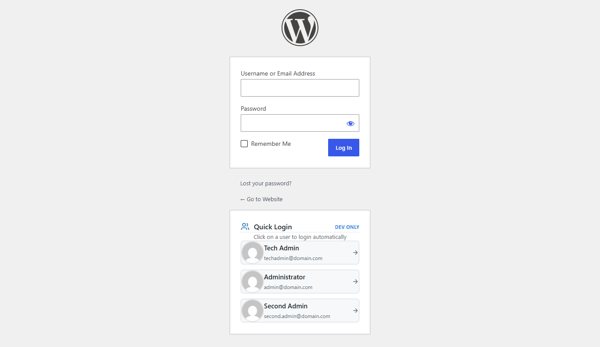

# Quick Admin Login

A WordPress plugin that displays admin users on the login page for quick, passwordless login. **Designed exclusively for local development and testing environments.**



## Description

Quick Admin Login simplifies the login process during development by listing up to 3 administrator users directly on the WordPress login page. Simply click on a user to automatically log in without entering a password.

## Features

- **Quick Login**: One-click login for administrator users
- **No Password Required**: Automatically authenticates selected users
- **User List Display**: Shows up to 3 admin users with avatars, names, and emails
- **Development Only**: Automatically disabled in production environments
- **Modern Design**: Clean, centered interface that matches WordPress admin styling
- **Responsive**: Works seamlessly on desktop and mobile devices

## Requirements

- **WordPress**: 5.0 or higher
- **PHP**: 7.0 or higher
- **Environment**: Local development only (see Security section)

## Installation

### Standard plugin

1. Download or clone this repository
2. Upload the `quick-admin-login` folder to the `/wp-content/plugins/` directory
3. Activate the plugin through the 'Plugins' menu in WordPress

Alternatively, you can install it directly:

```bash
cd wp-content/plugins
git clone https://github.com/abidarm/quick-admin-login.git
```

Then activate it from the WordPress admin panel.

### Must-use plugin (single file)

This plugin is a single-file plugin, so you can also install it as a **must-use (MU) plugin** without activation:

1. Copy only `quick-admin-login.php` to `/wp-content/mu-plugins/`
2. If the `mu-plugins` folder does not exist, create it first

MU plugins load automatically on every request, which is handy for local development setups where you always want quick login available.

## Usage

Once activated, visit your WordPress login page (`/wp-login.php`). You'll see a "Quick Login" section below the login form displaying up to 3 administrator users.

1. Click on any user in the list
2. You'll be automatically logged in and redirected to the WordPress admin dashboard
3. No password required!

## How It Works

The plugin:

1. Detects if you're in a local development environment
2. Queries for administrator users (limited to 3)
3. Displays them in a styled box on the login page
4. Handles authentication when a user is clicked
5. Redirects to the admin dashboard

## Environment Detection

The plugin automatically detects local development environments by checking for:

- `WP_DEBUG` constant set to `true`
- Localhost domains (`localhost`, `127.0.0.1`, `.local`, `.test`)
- `WP_ENVIRONMENT_TYPE` set to `'local'`

You can also filter the detection using:

```php
add_filter('quick_admin_login_is_local', function($is_local) {
    // Your custom logic
    return $is_local;
});
```

## Security

⚠️ **IMPORTANT**: This plugin is designed **ONLY** for local development and testing environments. It bypasses password authentication, which is a significant security risk.

**DO NOT use this plugin on:**
- Production websites
- Staging servers accessible from the internet
- Any environment where security is a concern

The plugin includes automatic environment detection to prevent accidental use in production, but you should always verify your environment settings.


## Customization

### Change User Limit

To change the maximum number of users displayed, you can filter the query:

```php
add_filter('get_users', function($args) {
    if (isset($args['role']) && $args['role'] === 'administrator') {
        $args['number'] = 5; // Change to 5 users
    }
    return $args;
});
```

### Custom Styling

The plugin includes inline CSS that can be overridden. You can add custom styles using the `login_enqueue_scripts` hook:

```php
add_action('login_enqueue_scripts', function() {
    ?>
    <style>
        .quick-admin-login-box {
            /* Your custom styles */
        }
    </style>
    <?php
}, 20);
```

## Development

### File Structure

```
quick-admin-login/
├── quick-admin-login.php  # Main plugin file
├── screenshot.png         # Plugin screenshot
└── README.md              # This file
```

### Contributing

Contributions are welcome! Please feel free to submit a Pull Request.

## Changelog

### 1.0.0
- Initial release
- Quick login functionality
- Environment detection
- Modern UI design
- Responsive layout

## License

This plugin is licensed under the GPL v2 or later.

```
Copyright (C) 2024 Mohamed Abidar

This program is free software; you can redistribute it and/or modify
it under the terms of the GNU General Public License as published by
the Free Software Foundation; either version 2 of the License, or
(at your option) any later version.

This program is distributed in the hope that it will be useful,
but WITHOUT ANY WARRANTY; without even the implied warranty of
MERCHANTABILITY or FITNESS FOR A PARTICULAR PURPOSE.  See the
GNU General Public License for more details.
```

## Author

**Mohamed Abidar**

- Website: [abidar.dev](https://abidar.dev)
- GitHub: [@abidarm](https://github.com/abidarm)

## Support

For issues, questions, or contributions, please visit the [GitHub repository](https://github.com/abidarm/quick-admin-login).

---

**Remember**: This plugin is for development use only. Never use it on production sites!

